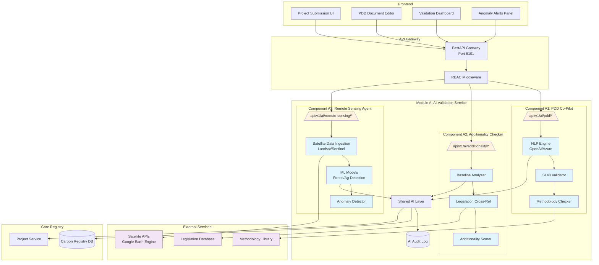

# Module A: AI-Powered Project Validation & MRV

## Architecture Overview



## Component Details

### A1: PDD Co-Pilot

**Purpose:** AI assistant for Project Design Document creation and validation

**Key Features:**
| Feature | Description | Tech Stack |
|---------|-------------|------------|
| Natural Language Input | Developers describe project in plain English | GPT-4 / Azure OpenAI |
| SI 48 Compliance | Auto-formatting per Statutory Instrument 48 of 2025 | Rule engine + LLM |
| Methodology Matching | Suggests applicable VCS/Gold Standard methodologies | RAG + Vector DB |
| Field Validation | Validates technical data (boundaries, baselines) | Pydantic + Domain rules |
| Explanation Generator | Creates human-readable summaries | LLM chain |

**API Endpoints:**
```yaml
POST /api/v1/ai/pdd/draft          # Generate PDD draft from description
POST /api/v1/ai/pdd/validate       # Validate existing PDD against SI 48
POST /api/v1/ai/pdd/suggest-method # Suggest methodologies for project type
GET  /api/v1/ai/pdd/templates      # List available PDD templates
```

### A2: Additionality Checker

**Purpose:** Algorithmic assessment of project additionality against Zimbabwe national legislation

**Key Features:**
| Feature | Description | Tech Stack |
|---------|-------------|------------|
| Baseline Calculator | Computes BAU (Business As Usual) emissions | Statistical models |
| Legislation Cross-Ref | Checks against existing laws/regulations | Vector search + NER |
| Financial Analysis | Evaluates financial viability without carbon revenue | Financial models |
| Barrier Assessment | Identifies non-financial barriers | LLM + Rule engine |
| Additionality Score | 0-100 confidence score with explanation | Ensemble model |

**API Endpoints:**
```yaml
POST /api/v1/ai/additionality/analyze      # Full additionality assessment
POST /api/v1/ai/additionality/baseline     # Calculate baseline scenario
POST /api/v1/ai/additionality/legislation  # Check regulatory context
GET  /api/v1/ai/additionality/explain/:id  # Get human-readable explanation
```

### A3: Remote Sensing Agent

**Purpose:** Satellite imagery analysis for carbon stock estimation and anomaly detection

**Key Features:**
| Feature | Description | Tech Stack |
|---------|-------------|------------|
| Forest Cover Analysis | Calculates forest biomass and carbon stocks | Random Forest / U-Net |
| Agriculture Monitoring | Tracks soil carbon in agricultural projects | Time series ML |
| Anomaly Detection | Flags unexpected burning, deforestation | Isolation Forest |
| Change Detection | Monitors land use changes over time | Siamese CNN |
| Forecasting | Predicts carbon stock changes | LSTM / Prophet |

**API Endpoints:**
```yaml
POST /api/v1/ai/remote-sensing/analyze       # Analyze project area
GET  /api/v1/ai/remote-sensing/status/:id    # Check analysis status
POST /api/v1/ai/remote-sensing/anomalies     # Detect anomalies
GET  /api/v1/ai/remote-sensing/forecast/:id  # Get carbon forecast
POST /api/v1/ai/remote-sensing/alert-config  # Configure alert thresholds
```

## Data Models

### AI Validation Result
```python
class AIValidationResult:
    validation_id: UUID
    project_id: UUID
    component: Literal["pdd", "additionality", "remote_sensing"]
    status: Literal["pending", "completed", "failed", "overridden"]
    confidence_score: float  # 0.0 - 1.0
    explanation: str
    evidence_references: list[str]
    raw_output: dict
    model_version: str
    prompt_version: str
    created_at: datetime
    human_override_status: Literal["none", "requested", "approved", "rejected"]
    human_override_by: UUID | None
    audit_event_id: UUID
```

### PDD Draft
```python
class PDDDraft:
    draft_id: UUID
    project_id: UUID
    raw_description: str
    structured_sections: dict  # SI 48 compliant sections
    methodology_suggestions: list[MethodologyMatch]
    compliance_score: float
    missing_fields: list[str]
    suggested_improvements: list[str]
```

### Additionality Assessment
```python
class AdditionalityAssessment:
    assessment_id: UUID
    project_id: UUID
    overall_score: float
    baseline_scenario: BaselineCalculation
    legislation_analysis: LegislationCheck
    financial_analysis: FinancialTest
    barrier_analysis: BarrierTest
    conclusion: Literal["additional", "not_additional", "inconclusive"]
    confidence: float
```

### Remote Sensing Analysis
```python
class RemoteSensingAnalysis:
    analysis_id: UUID
    project_id: UUID
    project_area_km2: float
    forest_cover_percent: float
    carbon_stock_tco2e: float
    historical_data: list[HistoricalReading]
    anomalies: list[DetectedAnomaly]
    forecast: CarbonForecast
    satellite_sources: list[str]  # Landsat, Sentinel, etc.
    imagery_date_range: tuple[date, date]
```

## Integration Points

### With Carbon Registry Service
- **Project Registration:** AI pre-validation before submission
- **Verification Workflow:** AI reports attached to verification evidence
- **Monitoring:** Continuous satellite monitoring of approved projects
- **Alerts:** Automatic notifications for anomalies

### With Blockchain
- **Immutable Audit:** AI result hashes stored on-chain
- **Verification Certificates:** AI analysis referenced in retirement certificates

## Security & Governance

### RBAC Permissions
```python
AI_RUN_MODEL = "ai.run_model"
AI_OVERRIDE = "ai.override"
AI_REVIEW = "ai.review"
VERIFICATION_DECIDE = "verification.decide"
```

### Audit Requirements
- Every AI output logged with full traceability
- Human override capability for all AI decisions
- Confidence thresholds for automatic vs manual review
- Bias monitoring and drift detection

## Deployment

### Services
| Service | Port | Container |
|---------|------|-----------|
| AI Validation API | 8103 | `ai-validation-service` |
| Model Inference | 8104 | `ml-inference-service` |
| Satellite Ingestion | 8105 | `satellite-worker` |

### Infrastructure
- GPU-enabled nodes for ML inference
- Object storage for satellite imagery
- Vector database for legislation/methodology RAG
- Redis for job queues
