# Module B & C: Smart Marketplace and Regulatory Compliance

## Architecture Overview

```mermaid
flowchart TB
    subgraph "Frontend"
        MARKET_UI[Marketplace UI]
        PRICING_DASH[Pricing Dashboard]
        COMPLIANCE_PORTAL[ZiCMA Compliance Portal]
        MATCHING_VIEW[Matching Agent Console]
    end

    subgraph "API Gateway"
        GW[FastAPI Gateway]
        RBAC[RBAC Middleware]
    end

    subgraph "Module B: Smart Marketplace"
        subgraph "B1: Dynamic Pricing Engine"
            PRICE_API[/api/v1/marketplace/pricing/*\]
            DEMAND[Global Demand Analyzer]
            NDC[NDC Cycle Tracker]
            VINTAGE[Vintage Scoring]
            AUTH[Authorization Pricing]
        end

        subgraph "B2: Bilateral Matching Agent"
            MATCH_API[/api/v1/marketplace/matching/*\]
            PREF[Buyer Preference Engine]
            NDC_MATCH[NDC Target Matcher]
            SCOPE[Scope 2/3 Analyzer]
            AI_MATCH[AI Matching Algorithm]
        end

        subgraph "B3: Trading Engine"
            TRADE_API[/api/v1/marketplace/trades/*\]
            ORDER[Order Book]
            SETTLE[Settlement Engine]
        end
    end

    subgraph "Module C: Regulatory Compliance"
        subgraph "C1: Serialization & Retirement"
            RETIRE_API[/api/v1/compliance/retirement/*\]
            SERIAL[Credit Serialization]
            SMART[Smart Contract Trigger]
            ZCR[ZCR Integration]
            UN_FILE[UN Reporting File Generator]
        end

        subgraph "C2: Authorization Workflow"
            AUTH_API[/api/v1/compliance/authorization/*\]
            LOA[Letter of Authorization]
            ZICMA_PORTAL[ZiCMA Digital Portal]
            PARIS[Paris Agreement Registry]
            TRACK[Authorization Tracker]
        end
    end

    subgraph "External Services"
        GLOBAL_PRICE[Global Carbon Price APIs]
        NDC_DB[NDC Database]
        ZCR[Zimbabwe Carbon Registry]
        UNFCCC[UNFCCC Reporting]
        PARIS_REG[Paris Agreement Registry]
        BLOCKCHAIN[Blockchain Network]
    end

    MARKET_UI --> GW
    PRICING_DASH --> GW
    COMPLIANCE_PORTAL --> GW
    MATCHING_VIEW --> GW

    GW --> RBAC --> PRICE_API
    RBAC --> MATCH_API
    RBAC --> TRADE_API
    RBAC --> RETIRE_API
    RBAC --> AUTH_API

    PRICE_API --> DEMAND --> NDC --> VINTAGE --> AUTH
    MATCH_API --> PREF --> NDC_MATCH --> SCOPE --> AI_MATCH
    TRADE_API --> ORDER --> SETTLE

    RETIRE_API --> SERIAL --> SMART --> ZCR
    SMART --> UN_FILE
    AUTH_API --> LOA --> ZICMA_PORTAL --> PARIS --> TRACK

    DEMAND --> GLOBAL_PRICE
    NDC --> NDC_DB
    ZCR --> ZCR_EXTERNAL[ZCR External]
    UN_FILE --> UNFCCC
    PARIS --> PARIS_REG
    SMART --> BLOCKCHAIN

    classDef moduleB fill:#e8f5e9
    classDef moduleC fill:#fff3e0
    classDef external fill:#f3e5f5

    class PRICE_API,MATCH_API,TRADE_API,DEMAND,NDC,VINTAGE,AUTH,PREF,NDC_MATCH,SCOPE,AI_MATCH,ORDER,SETTLE moduleB
    class RETIRE_API,AUTH_API,SERIAL,SMART,ZCR,UN_FILE,LOA,ZICMA_PORTAL,PARIS,TRACK moduleC
    class GLOBAL_PRICE,NDC_DB,ZCR_EXTERNAL,UNFCCC,PARIS_REG,BLOCKCHAIN external
```



## Module B: Smart Marketplace & Pricing

### B1: Dynamic Pricing Engine

**Purpose:** Real-time carbon credit pricing based on multiple factors

**Pricing Factors:**
| Factor | Weight | Description |
|--------|--------|-------------|
| Global Demand | 25% | Real-time market demand indicators |
| NDC Cycle | 20% | Alignment with Nationally Determined Contributions |
| Credit Vintage | 20% | Age of credits (newer = higher price) |
| Authorization Status | 25% | ITMO-eligible vs Voluntary |
| Project Type | 10% | Forestry, renewable, etc. |

**Credit Types:**
- **Authorized (ITMO-eligible):** Can be used for compliance under Article 6
- **Non-authorized (Voluntary):** For voluntary corporate commitments only

**API Endpoints:**
```yaml
GET  /api/v1/marketplace/pricing/current
POST /api/v1/marketplace/pricing/calculate
GET  /api/v1/marketplace/pricing/history
GET  /api/v1/marketplace/pricing/forecast
```

### B2: Bilateral Matching Agent

**Purpose:** AI-powered matching of host country credits with buyer NDC targets

**Matching Criteria:**
| Criteria | Description |
|----------|-------------|
| NDC Alignment | Does credit help buyer meet NDC target? |
| Scope Matching | Scope 2 (electricity) vs Scope 3 (value chain) |
| Sector Match | Renewable, forestry, waste, etc. |
| Vintage Preference | Buyer vintage requirements |
| Price Range | Within buyer budget |
| Authorization Required | ITMO vs Voluntary preference |

**Example Match:**
- **Host:** Zimbabwe solar project (authorized credits)
- **Buyer:** Germany needing Scope 2 NDC target
- **Match:** 95% compatibility - renewable energy, authorized, aligns with Scope 2

**API Endpoints:**
```yaml
POST /api/v1/marketplace/matching/find
GET  /api/v1/marketplace/matching/opportunities
POST /api/v1/marketplace/matching/preferences
GET  /api/v1/marketplace/matching/matches/:buyerId
```

### B3: Trading Engine

**Purpose:** Execute trades and manage settlements

**Features:**
- Order book management
- Bilateral trade execution
- Automated settlement
- Digital custody transfer

---

## Module C: Regulatory Compliance & Double Counting Prevention

### C1: Serialization & Retirement

**Purpose:** Prevent double counting through blockchain retirement

**Process Flow:**
1. Credit sold on marketplace
2. AI triggers smart contract
3. Credit retired on ZCR (Zimbabwe Carbon Registry)
4. Corresponding adjustment marked
5. UN reporting file generated automatically

**Key Features:**
- Unique serialization per credit
- Blockchain immutability
- Automatic corresponding adjustment
- UNFCCC-compliant reporting

**API Endpoints:**
```yaml
POST /api/v1/compliance/retirement/serialize
POST /api/v1/compliance/retirement/retire
GET  /api/v1/compliance/retirement/status/:serial
POST /api/v1/compliance/retirement/un-file
GET  /api/v1/compliance/retirement/un-file/:transactionId
```

### C2: Authorization Workflow

**Purpose:** Digital portal for Article 6 authorization letters

**Workflow:**
1. Project developer requests authorization
2. ZiCMA reviews application
3. Letter of Authorization (LoA) issued digitally
4. Status tracked in Paris Agreement Registry
5. Buyer verifies authorization status

**Authorization States:**
- `draft` - Application in progress
- `submitted` - Under ZiCMA review
- `under_review` - Technical assessment
- `approved` - LoA issued
- `rejected` - Application denied
- `transferred` - Credits transferred under Article 6

**API Endpoints:**
```yaml
POST /api/v1/compliance/authorization/apply
GET  /api/v1/compliance/authorization/status/:applicationId
GET  /api/v1/compliance/authorization/loa/:applicationId
POST /api/v1/compliance/authorization/zicma/approve
POST /api/v1/compliance/authorization/zicma/reject
GET  /api/v1/compliance/authorization/paris-sync
```

---

## Data Models

### Credit Listing
```python
class CreditListing:
    listing_id: UUID
    project_id: UUID
    serial_numbers: list[str]
    vintage_year: int
    quantity_tco2e: Decimal
    credit_type: Literal["authorized", "non_authorized"]
    project_type: str
    country_of_origin: str
    price_per_tco2e: Decimal
    authorization_status: AuthorizationState
    ndc_alignment_score: float
    scope: Literal["scope_1", "scope_2", "scope_3"]
```

### Price Point
```python
class PricePoint:
    timestamp: datetime
    credit_type: str
    vintage_year: int
    project_type: str
    price_usd: Decimal
    factors: dict[str, float]  # Individual factor contributions
    confidence: float
```

### Match Result
```python
class MatchResult:
    match_id: UUID
    buyer_id: UUID
    seller_id: UUID
    listing_id: UUID
    compatibility_score: float
    ndc_alignment: float
    scope_match: bool
    price_within_budget: bool
    authorization_match: bool
    recommendation: str
```

### Retirement Record
```python
class RetirementRecord:
    serial_number: str
    transaction_id: UUID
    retirement_date: datetime
    blockchain_tx_hash: str
    zcr_retirement_id: str
    corresponding_adjustment: bool
    un_file_generated: bool
    un_file_url: str
```

### Authorization Application
```python
class AuthorizationApplication:
    application_id: UUID
    project_id: UUID
    applicant_id: UUID
    status: AuthorizationState
    loa_document_url: str
    paris_registry_id: str
    authorized_quantity: Decimal
    authorization_date: datetime
    expiry_date: datetime
```

---

## Integration Points

### With Carbon Registry
- Credit issuance → Marketplace listing
- Retirement → Registry update
- Authorization → Registry flag

### With Blockchain
- Retirement smart contracts
- Serial number verification
- Ownership transfer

### With UNFCCC
- Automated reporting files
- Corresponding adjustment tracking
- ITMO transfer reporting

---

## Security & Governance

### RBAC Permissions
```python
MARKETPLACE_TRADE = "marketplace.trade"
MARKETPLACE_LIST = "marketplace.list"
PRICE_VIEW = "price.view"
MATCHING_RUN = "matching.run"
COMPLIANCE_RETIRE = "compliance.retire"
AUTHORIZATION_APPROVE = "authorization.approve"
ZICMA_ADMIN = "zicma.admin"
```

### Audit Requirements
- All trades logged with full traceability
- Pricing algorithm decisions explainable
- Retirement records immutable
- Authorization workflow auditable
