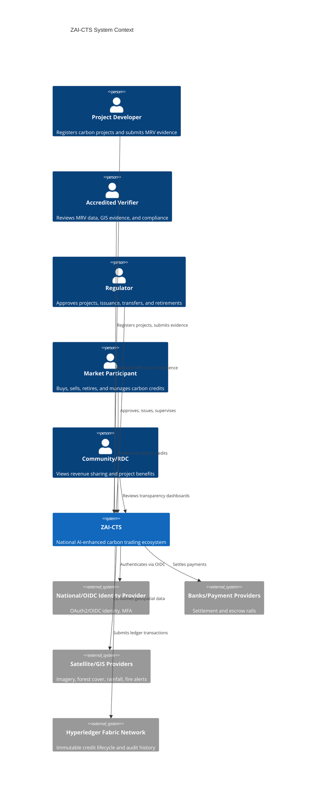
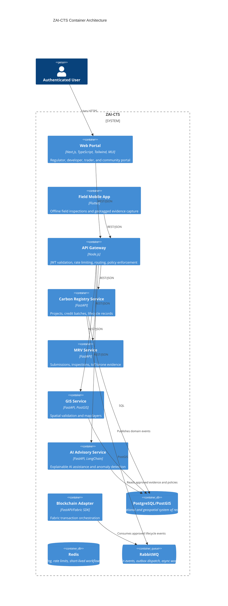

# ZAI-CTS Enterprise Architecture

Zimbabwe AI-Enhanced Carbon Trading Ecosystem (ZAI-CTS) is a national critical-infrastructure platform for carbon project registration, MRV, credit issuance, marketplace operations, community benefit transparency, GIS intelligence, AI-assisted verification, and immutable blockchain audit anchoring.

This repository follows the `MASTER_SPECIFICATION.md` as its constitutional specification.

## C4 Context

## C4 Containers

## Production Readiness Benchmarks

| Benchmark | ZAI-CTS Control |
| --- | --- |
| Microsoft Azure | Zero Trust, Kubernetes, managed identity patterns, telemetry-first design |
| SAP | Master-data discipline, approval workflows, auditability, financial-grade settlement records |
| Salesforce | Role-aware portals, case/workflow lifecycle, API-first extension model |
| Palantir | Data fusion across MRV, GIS, blockchain, AI, and regulatory sources |
| ArcGIS | PostGIS, map layers, satellite overlays, field evidence geotagging |
| Bloomberg | Market-grade pricing, trading records, portfolio views, immutable historical data |

